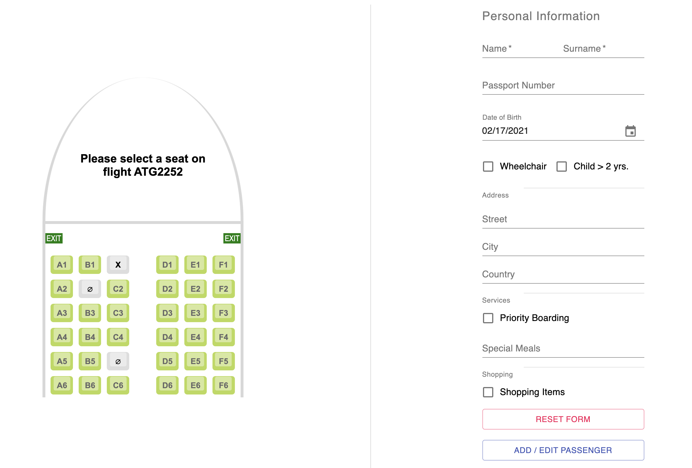

### React Redux-Thunk Flight App

#### Installation (this app needs yarn & npm)
```
- npm install yarn: https://www.npmjs.com/package/yarn

- yarn or npm i install all dependencies.
- yarn start or npm start to build the developement instance.
```
- the application will automatically open on port 8080. The api is going to work on Port 3001.



#### Short UX Description

This is a progressive react redux webapp to show how could be visualizes a possible airline passenger check-in procedure.
There are two user jurneys, one is the normal passenger and the other as a logged in admin.

#### Implemented technologies in this project

- Redux-Thunk with Webpack and Material-UI
- Mui-Datatable
- SASS SCSS preprocessoring with node-sass
- Enzyme-Jest unit & integration test for two
  redux action functions
- Json-Server as the mock api endpoint
- Toast and SweetAlert2 for the notifications
- Lazy loading components by redux transactions

##### Enzyme-Jest
```
- yarn test
- yarm test:watch
```
##### Lorant Vajda Github Repo (Lortschi)
[Link to Github Flight-App](https://github.com/lortschi/flight-app)


